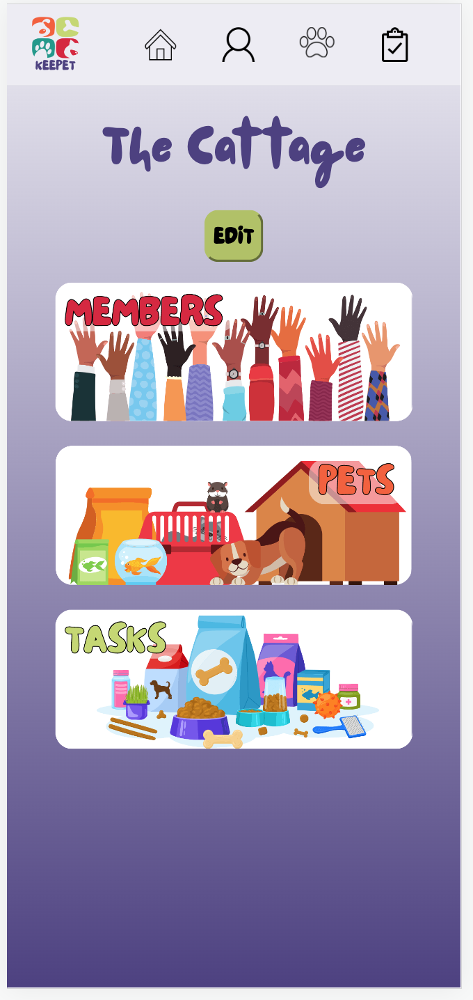
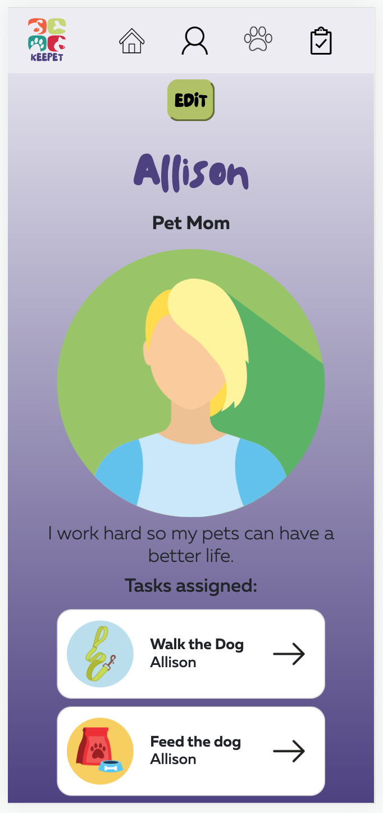
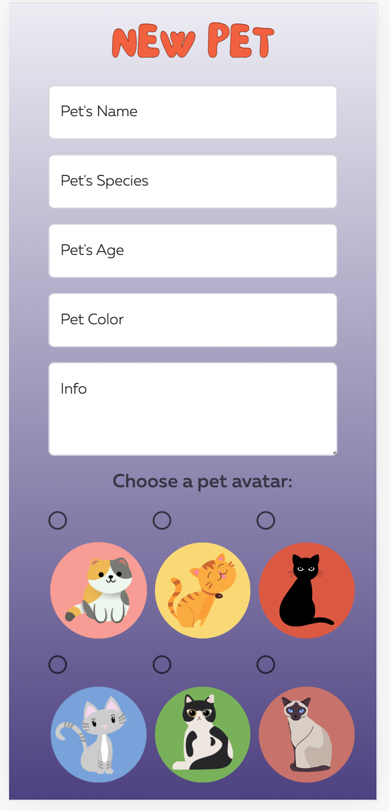
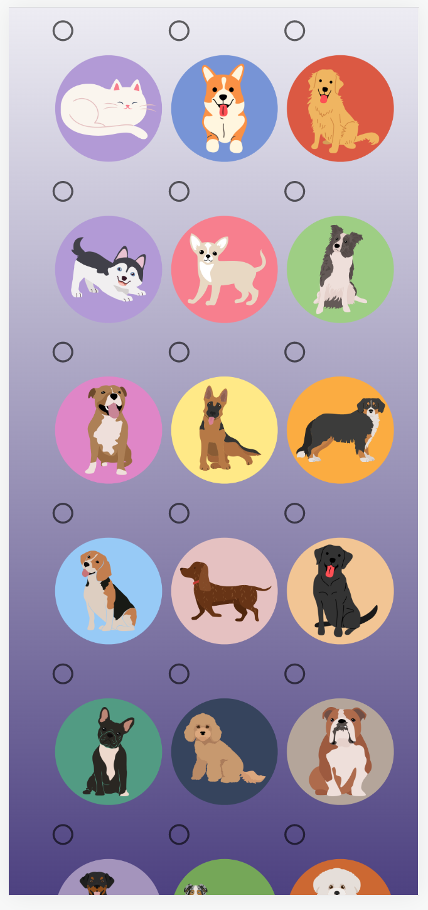
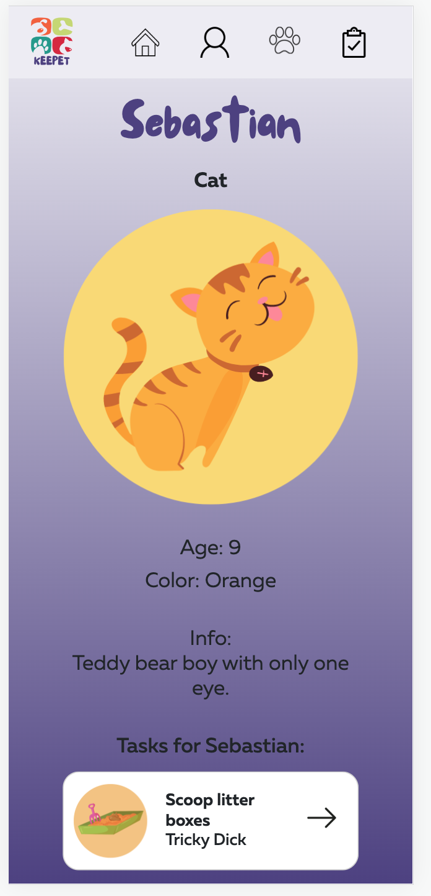
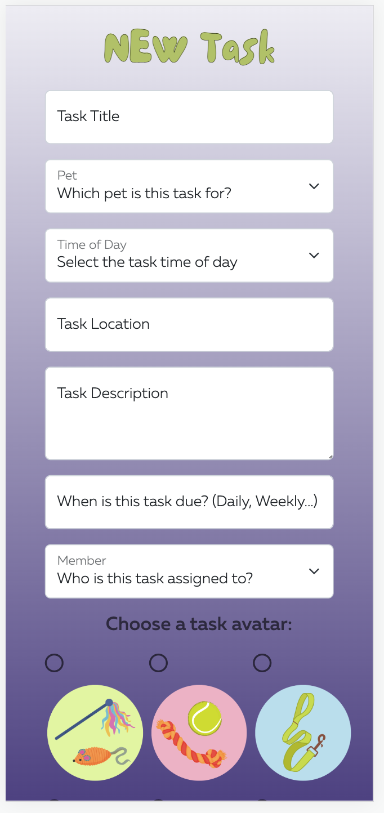
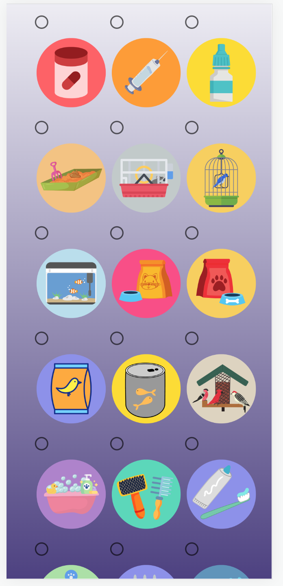
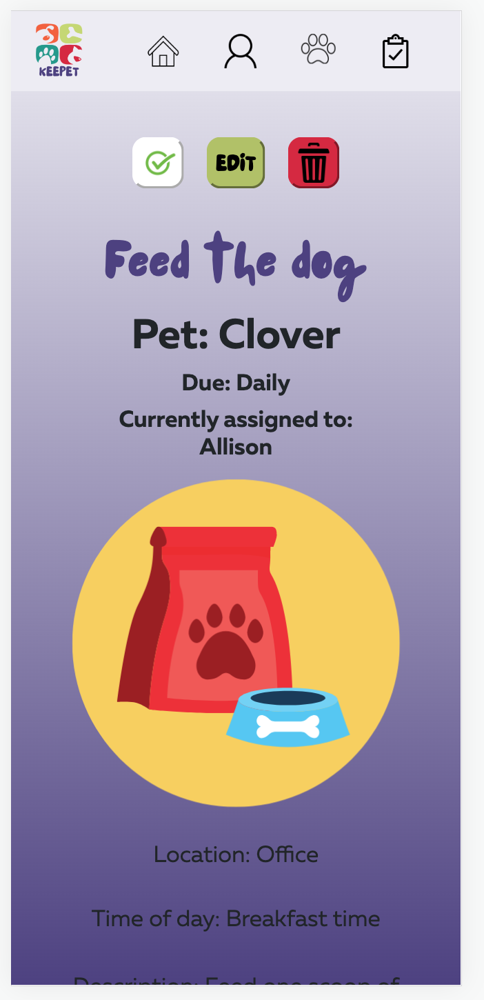
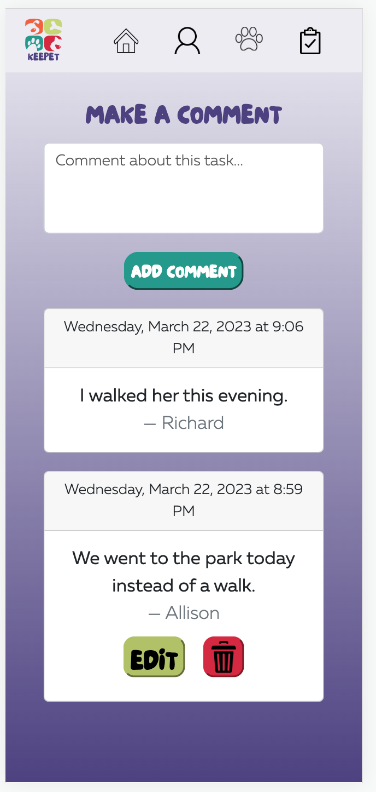

# Keepet  [](https://app.netlify.com/sites/keepet-app/deploys)

An app to help you organize your pets and people. 

[View App](https://keepet-app.netlify.app/)

## About the User <!-- This is a scaled down user persona -->
- The ideal user for this application is someone in a multi-person household who would like an app to help keep track of their pet(s) needs and tasks, and have the ability to share those tasks with other household members.
- This app provides a place to store all the most up-to-date pet information so everyone in the "household" can reference it. This way, everyone can be on the same page with pet needs, food amounts, medicine dosage, etc. and check off when things get done. No more accidental second breakfast for the dog! 

## Features <!-- List your app features using bullets! Do NOT use a paragraph. No one will read that! -->
- When a user logs in, they are prompted to create their member profile and can either create a household or join an existing one.
- If a user creates a household, they can CRUD all pets, all tasks, their own comments on tasks, and assign tasks to other members of the household. They can also edit their member profile and  household, but cannot delete them. 
- If a user is joining an existing household, they can CRUD their own pets and comments on tasks, and can "check off" any task, logging the time of last completion on the task card. They can edit their member profile, but cannot delete it. 

## Video Walkthrough of KEEPET <!-- A loom link is sufficient -->
tbd

## Relevant Links <!-- Link to all the things that are required outside of the ones that have their own section -->
- [Check out the deployed site](#https://keepet-app.netlify.app/)
- [Wireframes](#https://www.figma.com/file/HFKMgyagydKEm9daEzlWgN/%22Keepet%22-Wireframe?t=SOGAylZtNfgs8Smg-0)
- [Project Board](#https://github.com/users/allison-blumenthal/projects/3/views/2)
- [ERD](#https://lucid.app/lucidchart/91635de4-a3f8-43b0-a16c-0611440a7a4a/edit?viewport_loc=-255%2C-71%2C2066%2C1527%2C0_0&invitationId=inv_6eb510e6-d0cb-4569-8dc8-849868b0e9d9)

## Code Snippet <!-- OPTIONAL, but doesn't hurt -->
```
export default function TaskForm({ taskObj }) {
  const [member, setMember] = useState({});
  const [householdPets, setHouseholdPets] = useState([]);
  const [householdMembers, setHouseholdMembers] = useState([]);
  const [formInput, setFormInput] = useState({
    ...initialState,
    uid: taskObj.uid,
  });
  const router = useRouter();
  const { user } = useAuth();

  const getWholeHousehold = () => {
    getMemberByUID(user.uid).then((memberObj) => {
      setMember(memberObj[0]);
      getPetsByHouseholdId(memberObj[0].householdId)
        .then((petArr) => {
          setHouseholdPets(petArr);
          getMembersByHouseholdId(memberObj[0].householdId)
            .then((memberArr) => {
              setHouseholdMembers(memberArr);
            });
        });
    });
  };
}
```

## Project Screenshots <!-- These can be inside of your project. Look at the repos from class and see how the images are included in the readme -->










## Contributors
- [Allison Blumenthal](https://github.com/allison-blumenthal)
